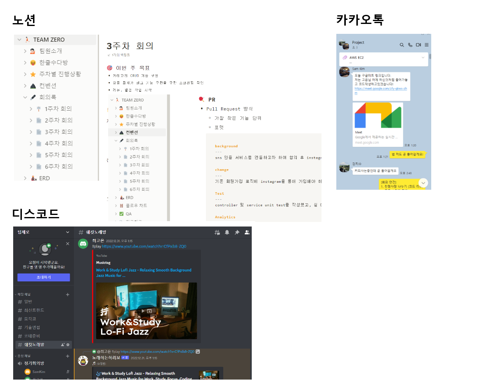
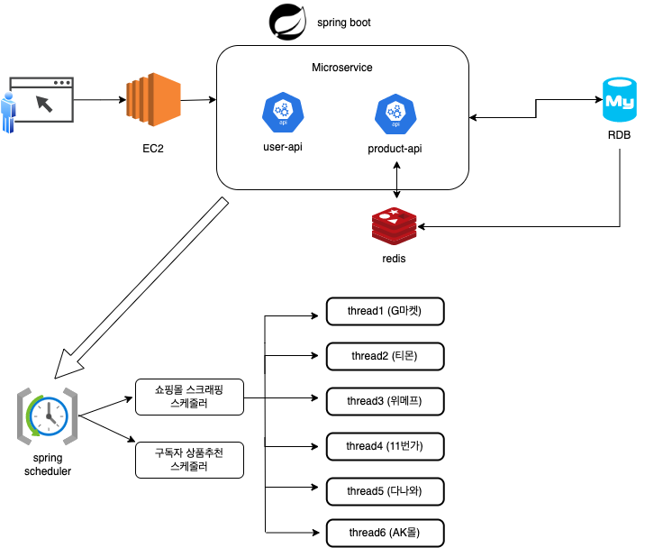
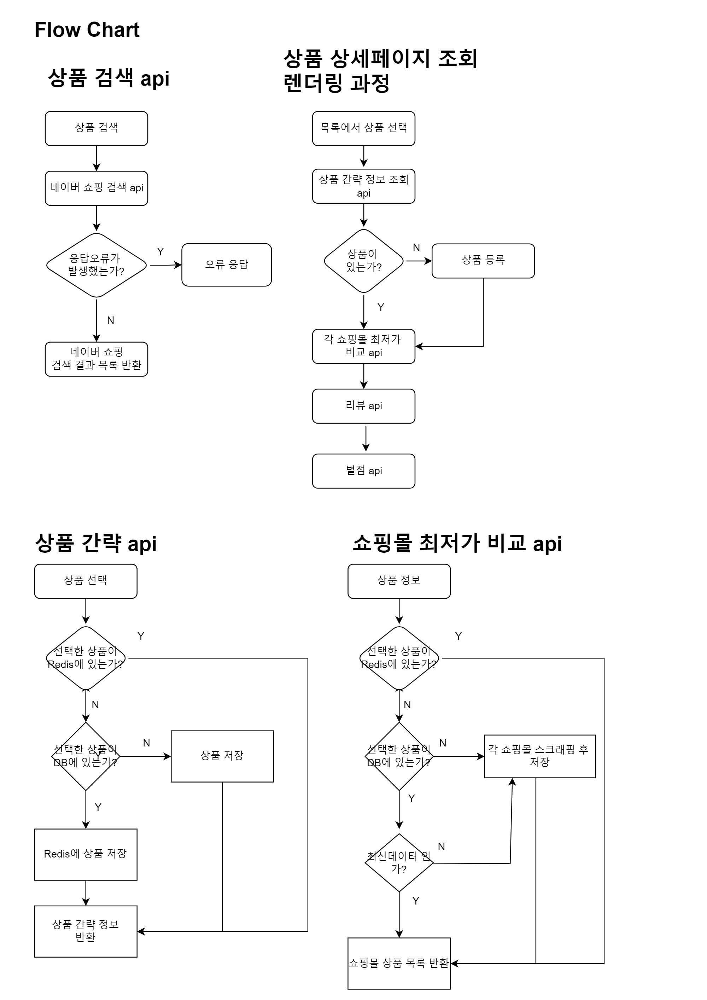
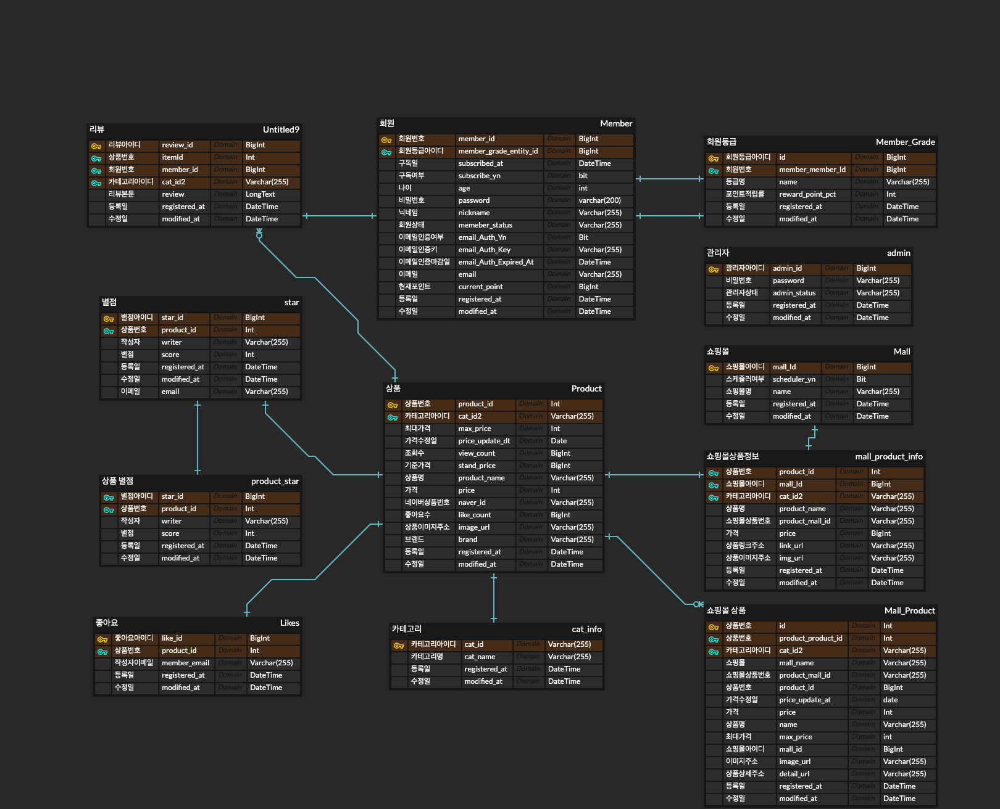

# zeroMall

## Overview


- 프로젝트명 : ZeroMall
- 기간 : 2022.11.21 - 2022.12.30
- 소개 : 각 쇼핑몰 사이트를 스크래핑하여 최저가 상품을 비교하고, 구독자에게 상품을 추천하는 서비스
- 노션 :  [📒 TEAM ZERO](https://www.notion.so/TEAM-ZERO-eac18135b69945f3b6d4181e88ea79de)
- 깃허브 : [🐶 ZeroMall](https://github.com/zero-mall/zeroMall)          

<br>

## 프로젝트 소개
```bash
- 유형 : 팀 프로젝트
- 기간 : 2022.11.21 - 2022.12.30
- 소개 : 각 쇼핑몰 사이트를 스크래핑하여 최저가 상품을 비교하고, 구독자에게 상품을 추천하는 서비스
- API : 
  1. 회원 : 일반회원은 제로몰 사이트를 방문하는 서비스 이용자이며, 관리자는 관리페이지에서 일반회원을 관리한다.
   - 일반회원(구매자) : 이메일 회원가입, JWT를 통한 로그인 인증, 나의 정보 수정, 탈퇴, 구독
   - 관리자 : 회원 목록 조회, 회원 상태 변경 (정지, 탈퇴)
   
  2. 상품 : 네이버 상품을 기준으로 각 쇼핑몰-AK몰/다나와/11번가/G마켓/티몬/위메프-에서 동일 상품을 검색하여 최저가를 비교
   - 카테고리(대분류/중분류/소분류) 관리
   - 네이버 쇼핑 open api를 통해 상품 검색 
   - 각 쇼핑몰 사이트로부터 동일 상품을 검색하여 스크래핑 & 최저가 상품 비교
   - 별점, 리뷰, 좋아요, 조회수 기능
   - 레디스를 통해 네이버 상품 검색 결과 및 각 쇼핑몰 스크래핑 결과 캐싱
   - 스케줄링을 통해 구독자에게 한 달 간격으로 이메일로 상품을 추천 
     (이번 달 가장 많이 할인된 상품 5선, 이번 달 30대's choice 상품 5선, 이번 달 우수 상품 5선)
```

<br>
   
## 팀원 소개
<details>
<summary>팀원 간 소통 방식</summary>
<div markdown="1">

```bash
* 소통 방식
- 매주 월/수/금 정기 회의 진행
- 노션을 통해 코드스타일, 회의록, 주차별 진행상황, 참고링크 등을 기록
- 구글 미트/카카오톡/디스코드를 통한 수시 소통

* 오프라인 만남
- 온라인을 통한 만남 외에 오프라인을 통해 회의 후 식사를 하며 친목을 다졌습니다.
```



</div>
</details>

|팀원| 작업 내역                                                                                                                                                                                                                                                        |
|---|--------------------------------------------------------------------------------------------------------------------------------------------------------------------------------------------------------------------------------------------------------------|
|최고은| - 회원 <br> &nbsp; - 일반회원 : 로그인 인증(JWT) <br>&nbsp;  - 관리자 : 회원 목록/상세 조회, 회원 상태 변경 <br>- 상품  <br>&nbsp; - 네이버 쇼핑 api 검색 <br>&nbsp;  - 티몬, 위메프 스크래핑 & 최저가 상품 비교  <br>&nbsp;   - 레디스를 통해 네이버 상품 검색 결과 & 스크래핑 결과 캐싱 <br>&nbsp;   - 별점, 조회수 기능 <br>&nbsp;   - 이번 달 30대’s choice 상품 추천  <br>&nbsp;   - 구독자 메일 전송 스케줄러 |
| 강지수 | - 회원 <br>&nbsp;   - 일반회원 회원가입<br>- 상품 <br>   &nbsp;- 카테고리 CRUD <br>   &nbsp;- 11번가, 다나와 스크래핑 & 최저가 상품비교<br>   &nbsp;- 상품정보 갱신 스케쥴러<br>   &nbsp;- 이번 달 우수 상품 추천 |
| 김찬혁 | - 회원 <br>   &nbsp;- 일반회원 : 비밀번호 초기화, 수정, 탈퇴<br>   &nbsp;- 관리자 : 관리자 회원가입, 상태 수정<br>- 상품 <br>   &nbsp;- 지마켓, AK몰 스크래핑 & 최저가 상품 비교<br>   &nbsp;- 리뷰 CRUD<br>   &nbsp;- 좋아요 기능<br>   &nbsp;- 구독 기능<br>   &nbsp;- 이번 달 가장 많이 할인된 상품 추천 |
   
<br>

## 기술 스택                  
                  
### Backend  
        
                  
### Database
  
                  
### Cloud
 
                  
### API  


<br>

## 아키텍처


<br>

## FLOW CHART
<details>
<summary>이미지로 보기</summary>
<div markdown="1">
                  


</div>
</details>

[▶ PDF로 보기](https://github.com/zero-mall/zeroMall/blob/main/zeromall-flowchart.pdf)

<br>

## ERD                  

  
<br>
  
## 프로젝트 주요 기능
```bash
포커스
1. 최저가 상품 비교 : 스크래퍼를 통해 각 쇼핑몰의 동일 상품 가져오기 & 최저가 비교 
2. 쇼핑몰 상품 갱신 : 스케줄러를 통해 각 쇼핑몰의 상품 정보 최신화
3. look-aside 캐시 : 레디스를 통해 검색 결과 및 스크래핑 결과 캐싱
4. 구독자 상품 추천 : 스케줄러와 Java-mail를 통해 구독자에게 상품 추천
```

<details>
<summary>기능 상세</summary>
<div markdown="2">
                  
### 1. **회원**

#### (1) 일반회원

| 회원가입 | Java-mail을 통해 회원가입 |
       | --- | --- |
| 회원 로그인 | email 과 password 요청하여 인증 |
| 회원 상세 조회 | JWT 토큰을 이용한 회원정보 조회 |
| 회원수정 | JWT 토큰을 이용한 회원정보 수정 |
| 회원탈퇴 | email을 통해 회원 탈퇴(탈퇴 시 플래그처리) |
| 구독, 구독 수정 | 결제 정보를 받아 회원등급 변경 |
| 구독 취소 | email과 구독id 통하여 회원등급 변경 |

#### (2) 관리자

| 관리자 가입 | email정보를 통해 관리자 생성 |
       | --- | --- |
| 관리자 로그인 | email 과 password 요청하여 인증 |
| 관리자 상태 수정 | JWT 토큰을 이용한 관리자 정보 수정 |
| 관리자 탈퇴 | email을 통해 회원 탈퇴 |
| 회원 목록 조회 | 가입된 회원의 목록을 페이징 처리를 통해 조회 |
| 회원 상세 조회 | 회원의 상세정보를 조회 |
| 회원 등급,상태 수정 | 회원 등급과 상태를 수정(탈퇴 시 플래그처리) |

### 1. **상품**
                  
####  (1) 카테고리 : 카테고리(대분류/중분류/소분류) 관리

| 카테고리 등록 | 해당 분류에 동일한 카테고리가 없는 경우 카테고리 생성 |
       | --- | --- |
| 카테고리 단일 조회 | 요청값( id, 이름, 타입)에 따라 카테고리 정보 조회 |
| 카테고리 전체 조회 | 등록된 전체 카테고리 조회 |
| 카테고리 수정 | 카테고리 id를 통해 카테고리명 수정 |
| 카테고리 삭제 | 연결된 하위 카테고리가 없을 경우 삭제 |
                  
####  (2) 최저가 상품 비교 : 스크래퍼를 통해 각 쇼핑몰의 동일 상품 가져오기 & 최저가 비교

| 네이버 상품 검색 | 네이버 쇼핑 검색 api를 통해 검색 결과 목록을 반환 |
       | --- | --- |
| 네이버 상품 간략 정보 저장 | 사용자가 네이버 상세페이지를 요청할 때 전달한 상품 간략 정보를 저장 |
| 쇼핑몰 상품 스크래핑  | 각 쇼핑몰에서 동일 상품 정보 스크래핑 후 저장 |
| 쇼핑몰 최저가 비교 | 각 쇼핑몰에서 스크래핑한 동일 상품들을 최저가순으로 반환 |
                  
####  (3) 쇼핑몰 상품 갱신 : 스케줄러를 통해 각 쇼핑몰의 상품 정보 최신화
                  
####  (4) look-aside 캐시   : 레디스를 통해 검색 결과 및 스크래핑 결과 캐싱

| 네이버 상품 검색 | 네이버 쇼핑 검색 api를 통해 반환 받은 검색 결과 목록을 캐싱 |
       | --- | --- |
| 쇼핑몰 상품 스크래핑 | 각 쇼핑몰에서 스크래핑 후 상품 정보를 캐싱  |
                  
####  (5) 구독자 상품 추천 : 스케줄러와 Java-mail를 통해 구독자에게 상품 추천

| 이번 달 가장 많이 할인된 상품 | 한달간 가장 가격인하가 많이 된 상품 5개 추천 |
       | --- | --- |
| 이번 달 N0대's choice 상품 | 한달간 해당 회원의 연령대에서 가장 인기가 많았던 상품 5개 추천  |
| 이번 달 우수 상품 | 한달간 별점, 좋아요가 제일 많은 상품 5개 추천 |
                  
####  (6) 별점, 리뷰, 좋아요, 조회수 기능

| 별점, 리뷰, 좋아요, 조회수 추가 | 상품id 통해서 추가 |
       | --- | --- |
| 별점, 리뷰, 좋아요, 조회수 조회 | 각 항목 별 id로 조회 |
| 별점, 리뷰 수정 | 별점, 리뷰의 각 항목 별 id로 수정 |
| 별점, 리뷰, 좋아요 삭제 | 각 항목 별 id로 삭제 |
</div>
</details>

<br>
                  
## API 명세서

|회원 API|상품 API|
|---|---|
|[user-api-document](https://github.com/zero-mall/zeroMall/blob/main/user-api.pdf)|[product-api-document](https://github.com/zero-mall/zeroMall/blob/main/product-api.pdf)|

<br>
                  
## 기술 특장점
### **통일성에 대한 지속적인 고민**
```bash
- 협업 및 분업을 원활하게 하기 위해 개발 시 통일성을 부여하고자 많이 고민했어요.
- 통일성 있는 코드를 위해 컨벤션을 정하고 작업했어요
- 작은단위의 PR을 통해 서로의 코드를 리뷰하며 피드백 했어요
- 주 3회의 회의를 통해서 코딩스타일을 통일하기위해 노력했어요
- 그 외 통일해야 할 부분을 발견하면 즉시 함께 고민하고 실행했어요
```

### **Redis활용을 통한 검색 속도 향상**
```bash
- 검색에 유리한 Redis캐싱을 활용하여 검색속도를 향상시켰어요
- JPA를 통한 조회보다 Redis를 통해 캐싱된 데이터를 불러오는게 더 효율적이라고 판단했어요
- 대규모 데이터를 빠르게 처리함에 있어 Redis가 더 유리해요
```

### **스케쥴링을 이용한 데이터 최신화**
```bash
- 스케줄러를 통해 매일 데이터를 자동으로 최신화해요
- 수작업으로 하기보단 멀티스레드를 이용한 스케쥴링을 통해 데이터를 최신화 하기로했어요
- 멀티스레드를 통해 더 많은 작업을 동시에 실행할 수 있어요
- 스케쥴링을 통해 알아서 정해진 시간에 데이터를 불러오게 기능을 구현했어요
```

### **클라우드 서비스 활용하여 작업효율 증대**
```bash
- 각자 다른 환경에서 작업하기때문에 통일된 작업환경이 필요했어요
- 통일된 환경에서 작업을 하는게 더 좋은 프로젝트 결과물을 만들어 낼 수 있을거라 생각했어요
- 여러가지 협업툴을 활용하는 방안을 구상해 봤지만 유료가 많아 도입하기 쉽지 않았어요
- AWS-RDS, AWS EC2를 이용해서 동일한 환경에서 작업하여 작업효율을 극대화 했어요
```

<br>

## Trouble Shooting

| 고은     | 찬혁     | 지수                                                                                 |
|--------|--------|------------------------------------------------------------------------------------|
| [자세히 보기](https://github.com/zero-mall/zeroMall/blob/main/TROUBLE_SHOOTING_GOEUN.md) | [자세히 보기](https://github.com/zero-mall/zeroMall/blob/main/TROUBLE_SHOOTING_CHANHYUK.md) | [자세히 보기](https://github.com/zero-mall/zeroMall/blob/main/TROUBLE_SHOOTING_JISU.md) |
